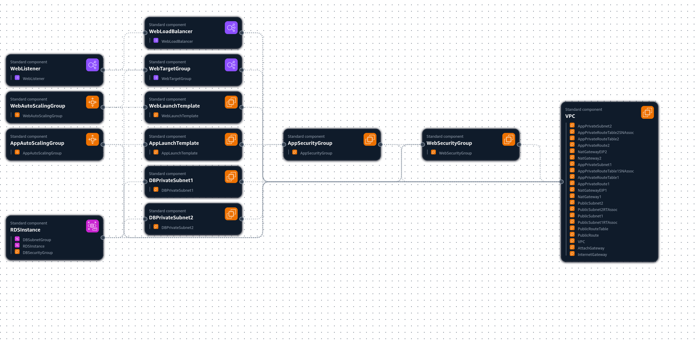

# AWS CloudFormation Template: 3-Tier Web Application

I built this CloudFormation template to practice building and deploying a classic highly available, fault-tolerant **3-Tier Web Application** architecture within a new Virtual Private Cloud (VPC) on AWS.

A 3-tier cloud architecure is a software design pattern that allows for the separation of concerns, and application security by splitting the architecture into three logical layers:

1.  **Web Tier (Public):** Internet-facing Application Load Balancer (ALB) and Auto Scaling Group (ASG) for web servers.
2.  **Application/Logic Tier (Private):** Auto Scaling Group (ASG) for application servers.
3.  **Database Tier (Private):** Multi-AZ RDS MySQL instance.

The **Web Tier** is the only tier accessible by the public internet, thus securing the other two layers by not allowing traffic to them directly.

---

## Architecture Summary

The stack deploys the following key components:

* **VPC and Subnets:** A single VPC with 6 subnets distributed across two Availability Zones (AZs): 2 Public, 2 Private for Application, and 2 Private for Database.
* **Networking:** An **Internet Gateway** for public access and two **NAT Gateways** (one per public subnet) for outbound internet access from private subnets.
* **Web Tier:** An **Application Load Balancer (ALB)** routes traffic to a web server **Auto Scaling Group (ASG)** in the Public Subnets.
* **Application Tier:** An **Auto Scaling Group (ASG)** for application logic is placed in the private Application Subnets.
* **Database Tier:** A **Multi-AZ RDS MySQL database instance** is secured in the private Database Subnets.

---

## AWS CloudFormation Canvas Representation

---
## Prerequisites

Before deploying this template, ensure you have the following:

1.  **AWS Account:** Access to an AWS account. **Note: Recommended to not use Root account**
2.  **Key Pair:** An existing EC2 Key Pair in the target region for SSH access to the EC2 instances. You will need to specify the name of this key pair as a parameter.

---

## 🚀 Deployment

### 1. Download the Template

Ensure the CloudFormation template file (`3-tier-web-app-v1.yaml`) is saved locally.

### 2. Deploy via AWS Management Console

1.  Navigate to the **CloudFormation** service in the AWS Console.
2.  Click **Create stack** -> **With new resources (standard)**.
3.  Under **Specify template**, select **Upload a template file** and choose `3-tier-web-app-v1.yaml`.
4.  Click **Next**.
5.  **Specify stack details:**
    * **Stack name:** Choose a descriptive name (e.g., `3-Tier-Web-App-Demo`).
    * **Parameters:** Fill in the required values:
        * `KeyName`: The name of your existing EC2 key pair.
        * `WebServerInstanceType`: EC2 instance type for the Web Tier (default: `t2.micro`).
        * `AppServerInstanceType`: EC2 instance type for the App Tier (default: `t2.micro`).
        * `DBUser`: Master username for RDS (default: `admin`).
        * `DBPassword`: Master password for RDS (default: `97A8d4c1d98fb5d5`). **Note: It is highly recommended to change this default password.**
6.  Complete the remaining steps, acknowledge the creation of IAM resources (if any future version includes them), and click **Create stack**.